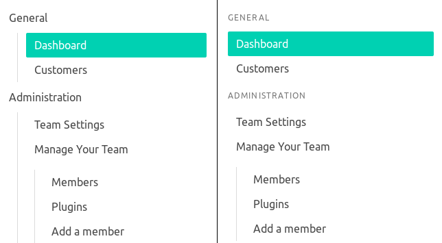
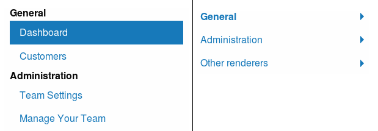

# Navtastic

[](https://circleci.com/gh/aramvisser/navtastic)
[](https://codeclimate.com/github/aramvisser/navtastic)
[](https://inch-ci.org/github/aramvisser/navtastic)
[](https://rubygems.org/gems/navtastic)
[](https://github.com/aramvisser/navtastic/blob/master/LICENSE)

Navtastic is way to create and display complex navigation menus for websites. It allows for runtime
configurations of menus, depending on context.

- Keep menu content and rendering logic separate
- Automatically highlight the current page
- Different output structures supported (Simple, Bootstrap4, Bulma, Foundation6)
  - HTML structure only, bring your own CSS.

## Table of Contents

- [Installation](#installation)
- [Example](#example)
- [Documentation](#documentation)
  - [Submenus](#submenus)
  - [Current item](#current-item)
  - [Runtime parameters](#runtime-parameters)
  - [Configuration](#configuration)
  - [Renderers](#renderers)

## Installation

Add it to your Gemfile:

```ruby
gem 'navtastic'
```

Run the following command to install it:

```console
bundle install
```

## Example

Define a menu somewhere:

```ruby
Navtastic.define :main_menu do |menu|
  menu.item "Home", '/'
  menu.item "Posts", '/posts'
  menu.item "About", '/about'
end
```

Render it in your partials:

```erb
<%= Navtastic.render :main_menu, current_url %>
```

Using the default renderer, assuming that the current url starts with `/posts`, will result in:

```html
<ul>
  <li>
    <a href="/">Home</a>
  </li>
  <li class="current">
    <a href="/posts">Posts</a>
  </li>
  <li>
    <a href="/about">About</a>
  </li>
</ul>
```

## Documentation

### Submenus

Every item can have a submenu. They can be nested as deeply as you want.

```ruby
Navtastic.define :main_menu do |menu|
  menu.item "Home", '/' do |submenu|
    submenu.item "Posts", '/posts'
    submenu.item "About", '/about'
  end

  menu.item "Settings" do |submenu|
    submenu.item "General", '/settings'
    submenu.item "Profile", '/settings/profile'
  end
end
```

By default, submenus will be rendered inside the `<li>` tag of the parent item.

```html
<ul>
  <li>
    <a href="/">Parent</a>
    <ul>
      <li>
        <a href="/child">Child</a>
      </li>
    </ul>
  </li>
</ul>
```

### Current item

The current active item is decided by the `current_url` parameter when rendering a menu. It is the
item with the longest url that starts with the current_url.

For example, if there is a menu containing these urls:

- `/`
- `/posts`
- `/posts/featured`

If the current_url is `/posts/featured/2017`, the `/posts/featured` item will be highlighted. If the
current_url is `/posts/123`, then `/posts` is highlighted.

The root url `/` will always match, if no other items match the current url. If there is no item
with `/` as url in the menu and no other urls match, nothing will be highlighted.

### Runtime parameters

You can pass runtime parameters when defining a menu. For example, passing the current user and
change the menu accordingly.

```ruby
# Define the menu
Navtastic.define :main_menu do |menu, params|
  menu.item "Home", "/"

  if params[:current_user]
    menu.item "Profile", "/users/#{params[:current_user].id}"
    menu.item "Logout", "/logout"
  else
    menu.item "Login", "/login"
  end
end

# Render it with the current user as a parameter
Navtastic.render :main_menu, current_url, current_user: User.current
```

### Configuration

Some global settings that Navtastic uses can be configured. Make sure the configuration happens
before defining any menu (e.g. when using rails, add it to `config/initializers/navtastic.rb`).

These are the defaults values:

```ruby
Navtastic.configure do |config|
  # Set the renderer to use, can be one of :simple, :bootstrap4, :bulma, :foundation6
  # Can also be a class if you want to use a custom renderer
  config.renderer = :simple
end
```

### Renderers

The following renders are currently available:

- **Simple** adds a `current` class to the basic list structure
- **Bootstrap4** is used with the [Bootstrap 4](https://getbootstrap.com) framework.
- **Bulma** is used with the [Bulma.io](http://bulma.io) framework.
- **Foundation6** is used with the [Foundation 6](http://foundation.zurb.com/sites.html) framework.

Some renderers also support extra options that you can pass when rendering a menu:

```erb
<%= Navtastic.render :menu, current_url, renderer: { option: value } %>
```

#### Bulma Configuration

- **headers** (default: `false`)

  Top level items are styled differently. Works best if they are only text, not
  links.

  <div align="center">
    <figure>
      <br>
      <figcaption>left: <code>headers: false</code>, right: <code>headers: true</code></legend>
    </figure>
  </div>

#### Foundation Configuration

- **active_class** (default: `nil`)

  CSS class to use for active items. Active items are items that have a child that is the current
  item. Useful to highlight the current item in a drilldown menu.

- **style** (default: `nil`)

  Set to `:drilldown` to generate [a drilldown
  menu](http://foundation.zurb.com/sites/docs/drilldown-menu.html). Make sure you include the
  required javascript files.

  <div align="center">
    <figure>
      <br>
      <figcaption>left: default style, right: drilldown style</figcaption>
    </figure>
  </div>
